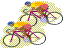

# CyclingApps
Cycling apps and tools of officials.  Aa new class of applications that run in the browser and read/write to .csv files on your computer.  Zero-install and serverless.

# Track Cycling

## [ Points Race Web (click here)](https://raw.githack.com/esitarski/CyclingApps/main/points_race_web.html)

A browser-based app to score __Points, Madison, Tempo, Scratch and Snowball__ races.

Score races easily and perfectly.  Vastly superior to a paper scoring sheet.  Removes stress and tedium.  Have fun!

Runs in a browser on __any__ device including Tablets, Laptops, Mobile Phones and Desktops on iOS, Android, Windows, MacOS or Linux
(a mobile phone screen may be too small - try it ahead of time).

Does not require access to the internet (web page can be downloaded ahead of time and loaded from an html file).  Does not access the internet while running.

Import starting points for Omnium.  Output .csv files for the results for publishing.

Click on the link above.  After the page opens, press __Show Help__ for details.
